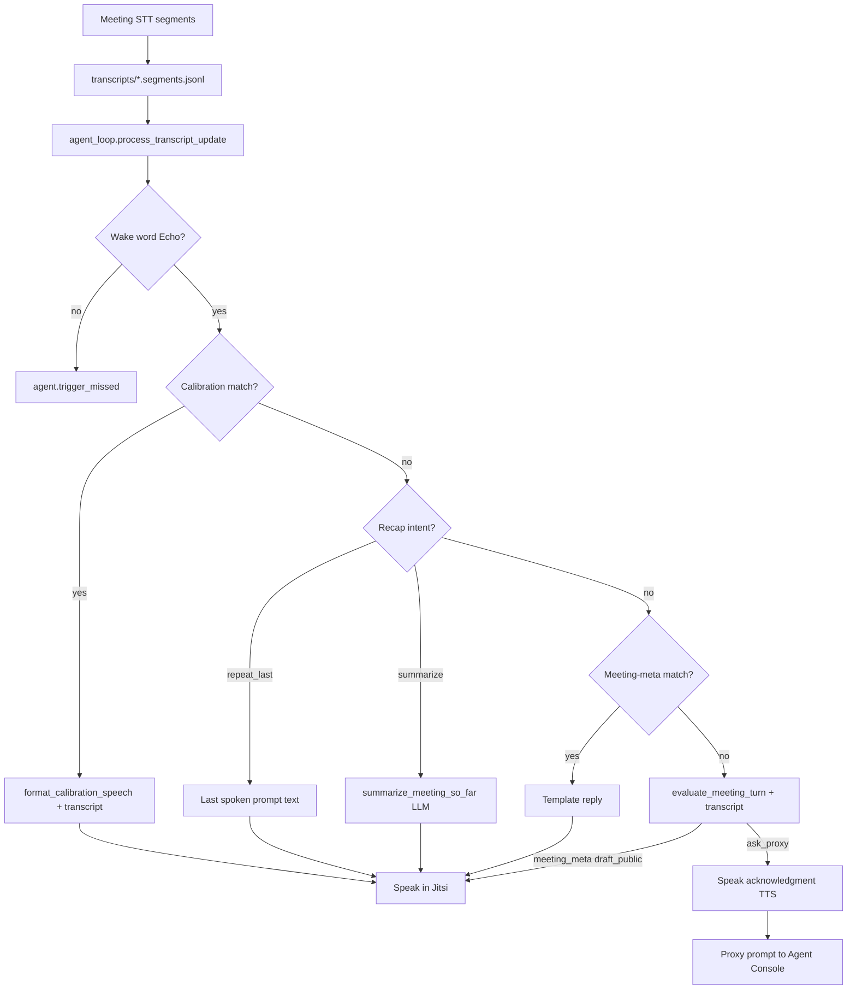

# Phase 8 — Echo: Conversational, Context-Aware Proxy Agent

## Goal

Make the embodied HA agent feel like a natural meeting participant: context-aware replies, polite acknowledgments when uncertain, and consistent terminology for the off-call proxy user.

## Decisions

| Topic | Decision |
|-------|----------|
| Agent name | **Echo** — agent-like (“echo the user”), STT/TTS friendly |
| Proxy user label | **“my user”** in meeting speech (not “representative”, not “Person C”) |
| Policy structure | Separate **`agent_policy.md`** loaded into the system prompt; study-facing rules live here |
| Transcript context | Include recent meeting transcript in **all** LLM speech paths (calibration polish + novel/proxy turns) |
| Unknown answer | Echo **speaks a brief acknowledgment** in Jitsi, then escalates privately to the Agent Console |

## Architecture

## Question routing tiers

| Tier | Examples | Meeting | Console |
|------|----------|---------|---------|
| Calibration | "what hotel?", "flight time?" | Auto-speak | No |
| Meeting recap | "what did you just say?", "summarize the meeting" | Auto-speak | No |
| Meeting-meta | "can you hear me?", "are you there?", "hello" | Auto-speak | No |
| Substantive unknown | "tell me a story", opinion on plan | Brief ack | Yes |

Deterministic matchers: [`backend/app/services/meeting_recap_matcher.py`](backend/app/services/meeting_recap_matcher.py) and [`backend/app/services/meeting_meta_matcher.py`](backend/app/services/meeting_meta_matcher.py) run after calibration, before the LLM. Recap `repeat_last` replays the most recent spoken prompt from `agent_prompts`; `summarize` calls the LLM with the full transcript budget.

## Agent policy (`backend/data/prompts/agent_policy.md`)

Behavioral rules separate from scenario/calibration facts:

1. **Tone** — conversational teammate, not FAQ bot; 1–3 short spoken sentences.
2. **Context use** — read recent transcript; reference what others said when relevant.
3. **Disagreement / alternatives** — e.g. “Sorry — meeting at Leicester isn’t suitable for my user; they suggest … instead.”
4. **Unknown answers** — acknowledge when addressed: “Hi — sorry, I don’t have that from my user. I’ll check with them and get back to you.”
5. **Terminology** — in meeting audio use **“my user”**; in Agent Console use plain language for the proxy participant.
6. **Facts** — never invent; calibration facts stay accurate even when phrased naturally.

## Implementation checklist

### Backend
- [x] `agent_policy.md` + `{{agent_policy}}` in `agent_system.md`
- [x] `build_system_prompt()` loads policy; `{{proxy_user_label}}` = “my user”
- [x] `format_calibration_speech()` receives transcript segments
- [x] `agent_loop`: speak meeting acknowledgment before proxy console prompt
- [x] Default display name / wake phrase: **Echo** / `echo`
- [x] STT aliases: `eko`, `eco`, `ekko`, `hecho`, `ako`, `ayako`, `aiko`, etc.; extra literal aliases via `AGENT_TRIGGER_ALIASES_EXTRA`
- [x] `meeting_meta_matcher.py` + three-tier routing in `agent_loop.py`
- [x] `meeting_recap_matcher.py`: "what did you just say" replays last spoken prompt; "summarize the meeting" answers via LLM
- [x] `meeting_meta` / `meeting_recap` source types on prompts and LLM output
- [x] Console proxy messages ask Person C for input (no spoken draft)
- [ ] Optional: include prior Echo utterances from `agent_prompts` in transcript context
- [x] Update `token_registry.jsonl` with `agentDisplayName: Echo`, `agentTriggerPhrases: ["echo"]`

### Frontend
- [x] Onboarding + Agent Console copy → Echo (dynamic from session)
- [x] Dynamic `agentDisplayName` from session where hard-coded

### Agent-bot
- [x] Default `AGENT_DISPLAY_NAME=Echo`

### Study ops
- [x] Re-copy / update `token_registry.jsonl` with `agentDisplayName: Echo`, `agentTriggerPhrases: ["echo"]`
- [ ] Brief moderator script: address agent as **“Echo, …”** at start of utterance
- [ ] Restart backend after deploy

## Test plan

1. **Wake word**: “Echo, what hotel are we staying at?” → conversational calibration reply referencing context if prior discussion exists.
2. **Flight time**: “Echo, what time do we fly out?” → “We’re flying out at 9 a.m.” (not bare digits).
3. **Novel question**: “Echo, tell me a story” → spoken ack in meeting + console prompt for my user.
4. **Disagreement scenario** (manual): moderator proposes dropped calibration location → Echo references their suggestion and offers my user’s alternative via policy-guided reply.
5. **STT noise**: “eco” / “Echo” variants still trigger; common false positives (e.g. “my vote”) do not.

## Out of scope (later)

- Cross-meeting memory
- Voice clone policy wording
- Automatic summarization of long transcripts (currently char-budget trim only)
